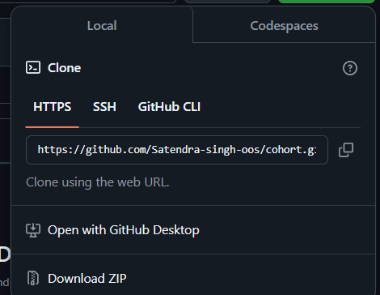

# Welcome To Git-Github Docs

- This Documentation will guide you through how to use git and github , what is git and github.
what are the standard practice to use the git and github.

## What is Git ?
-  Git is a version control system that allows us to track changes in files and collaborate with others. It also provides different functionalities like branching and merging code. These terms might not be familiar to you, but we will see them in a minute. Lets first clear and take a small note on what is version control system.

> 📝 A version control system is a tool which help software developer to keep the history and track of the code over a time. (PS: it like a book where all the records of your past has been mentioned 😜)

> Popular VCS Tools: Git,Subversion,Mercurial, perforce , so the Git is most popular and widely used Version control system cause it support distributed workflows.


## What is Github ?
- It us a online platform where we can store our code and can share with team member and other stack holders. But Github is not a only platfrom out there there are many otehr like Bitbucket ,Gitlab etc


## Installation and Setup Git 

Step 1 - Download git from here - [Download Git](https://git-scm.com/downloads)


Step 2 - Create Account on Github - [Github](https://github.com/signup)

Step3 - now open your terminal and write this if you se something like this then git is installed successfully

```bash
git
```


Step 4 - Open your terminal and run the following command  to  Set your email address and Set your username in git


```
    
 git config --global user.name "FIRST_NAME LAST_NAME"

 git config --global user.email "Your_Email@example.com"
```


**- 🛃 Checkpoint if you done with all the above steps you are now able to save your , see and get other code from github**

# Clone The  Repository:
  Step 1: open you can see the green button Code on top right  
click and copy the http  link



Step 2: Now go to your terminal and paste the below commond

```bash
 git clone https://github.com/Satendra-singh-oos/cohort.git
```

- After cloning the repository will be present in you local system  you can open it in your favorite code editor You can also use VSCODE the most popular code editor out there

Step3 :- Navigate to the folder right click and open with you code editor


**- 🛃 Another checkpoint now we have successfully opened the folder in our favorite code editor and we can start using git**


# Basic Git Commands

- let's get our hand dirty first we will se some of basic and daily use of git commands 

---

1. **`git init`**  
   Initializes a new Git repository in your project folder.  

2. **`git clone <REPO_URL>`**  
   Creates a local copy of a remote repository.  

3. **`git status`**  
   Displays the current status of your working directory, including untracked, modified, and staged files.  

4. **`git add <file>`**  
   Stages a specific file for commit.  

5. **`git add .`**  
   Stages all changes in the current directory for commit.  

6. **`git commit -m "message"`**  
   Commits the staged changes with a meaningful message.  

7. **`git push origin <BRANCH_NAME>`**  
   Pushes your commits to the specified branch in the remote repository.  

8. **`git pull`**  
   Fetches and merges changes from a remote repository into your current branch.  

9. **`git branch`**  
   Lists all branches in your repository and highlights the current branch.  

10. **`git checkout <BRANCH_NAME>`**  
    Switches to the specified branch.  

11. **`git merge <BRANCH_NAME>`**  
    Merges the specified branch into the current branch.  

12. **`git log`**  
    Displays the commit history for the current branch.  

13. **`git diff`**  
    Shows the differences between your working directory and the last commit.  

14. **`git rm <file>`**  
    Removes a file from the repository and stages the deletion for commit.  

15. **`git reset <file>`**  
    Unstages a file that has been staged for commit.  

16. **`git remote -v`**  
    Displays the remote repositories associated with your local repository.  

17. **`git help <COMMAND>`**  
    Provides detailed help information about a specific Git command.  
---


## Now Let's start with git and github and push some code in this repo as you successfully cloned 

 - In this section you will learn what the branching, merging, what are the practices we follow (PS 💡you will learn thing's while doing . ). 

 - Before starting first and last rule never push anything in main branch , we will also protect the branch and learn how to do that we can see on the go.

Let's understand what is the branch in git :-

->  

